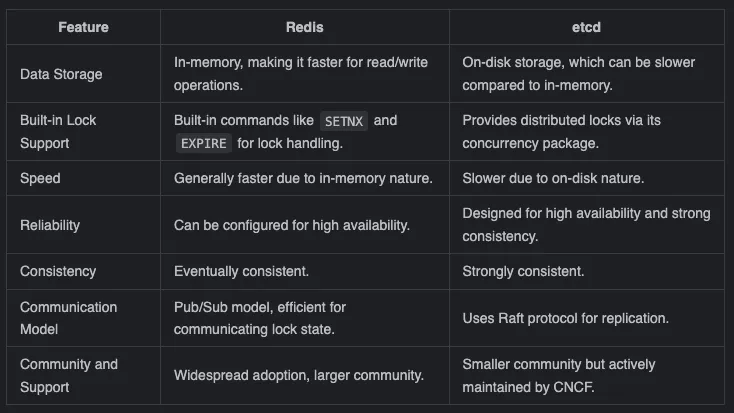
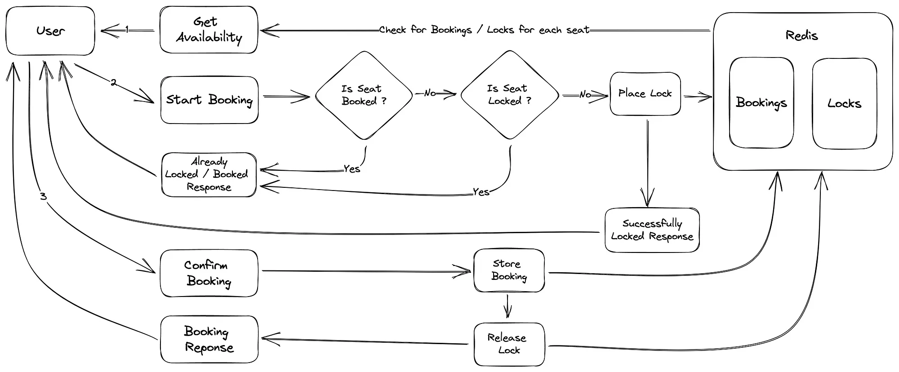

In distributed systems, there are challenges related to concurrent access to shared resources. To address this, a solution known as "Distributed Locking" is employed. It ensures that only one request can access a resource at a time, thereby avoiding confusion and mistakes.

One tool that can be utilized in this context is Redis. Redis is a particularly suitable choice for implementing distributed locks due to its impressive performance and rich feature set. Its in-memory data structure store facilitates extremely fast read and write operations, which are crucial for efficient management of locks in real-time scenarios.

To provide a simplified comparison between Redis and Etcd, let's examine some of the features required for an ideal distributed locking mechanism:



## Distributed Locking
Distributed locking is a way to control who gets to use shared stuff in a network of computers, called a distributed system. This method makes sure that when many processes want to use the same thing at the same time, they don’t mess things up.

Think about several transactions trying to change the same data in a database. Without control, they could mess up the data. But a distributed lock stops this. It lets only one transaction make changes at a time. Others have to wait their turn. This way, we keep everything organized and avoid mistakes.

## Project 


To reproduce this scenario, we choose to use an example of how a movie sells seats. Then, we will use the Redis Database to come up with a solution. The following dependencies are needed for this project:

```txt:requirements.txt
fastapi
uvicorn
redis
python-dotenv

```
### Inital Building Blocks

Next, we will construct the entities (models) Movie and Booking, which will store the film details and seat arrangements. FastAPI pairs well with pydantic, a tool that speeds up our service development with type hinting. Plus, it automatically generates API documentation for us, making our work much easier.

````python:models.py
from typing import Dict

from pydantic import BaseModel


class Movie(BaseModel):
    name: str
    id: str
    seat_map: Dict[str, bool]  # Dictionary to track seat availability


class Booking(BaseModel):
    movie: str
    seat_id: str
````
Now setup the data models, it's time to create the redis client. We'll use this for establishing  lock and saving our bookings.
```python:redis_client.py
import os
import redis

# Get Redis connection details from environment variables
REDIS_HOST = os.getenv("REDIS_HOST", "localhost")
REDIS_PORT = int(os.getenv("REDIS_PORT", 6379))

# Connect to Redis
redis_client = redis.Redis(host=REDIS_HOST, port=REDIS_PORT)

# Constants
LOCK_EXPIRATION_TIME = 300  # 5 minutes
```

It is possible to change the LOCK_EXPIRATION_TIME to control how long a resource is kept off-limits to others. After a period of 5 minutes, Redis will clear the lock from its memory, making the resource available for use again.

Now it needs to use some helper function, that will make possible for setting and removing the locks on a specific resource. For our movie seat example, we'll use a unique `seat_id` to identify which seat we're locking.

```python:utils.py
from fastapi import HTTPException

from redis_client import redis_client, LOCK_EXPIRATION_TIME


def lock_seat(seat: str) -> None:
    # Generate the key for the seat lock
    key = f"seat:{seat}"

    # Try to acquire the lock
    acquired = redis_client.set(key, "locked", ex=LOCK_EXPIRATION_TIME, nx=True)
    if not acquired:
        raise HTTPException(status_code=409, detail="Seat already locked")


def unlock_seat(seat: str) -> None:
    # Generate the key for the seat lock
    key = f"seat:{seat}"

    # Release the lock
    redis_client.delete(key)
```

The `lock_seat` function scans for existing locks associated with a particular `seat_id`. If it does not find any, it moves forward and sets a lock, which lasts for a 5-minute duration, as we've set up in the `redis_client.py` file.

### **Populate data **

With all set, we can now populate the with initial data. We'll do this by utilizing the on startup event decorator provided by FastAPI.

```python:main.py
from fastapi import FastAPI, HTTPException
from fastapi.responses import JSONResponse
from typing import Dict

from models import Movie, Booking
from redis_client import redis_client
from utils import lock_seat, unlock_seat

app = FastAPI(name="Movie Booking Service", version="1.0.0")

movie = Movie(id="avengers_endgame", name="Avengers Endgame",
              seat_map={"A1": True, "A2": True, "B1": True, "B2": True})


@app.on_event("startup")
async def startup_event():
    # Set initial seat availability
    for seat in movie.seat_map.keys():
        booking_key = f"booking:{seat}"
        if not redis_client.exists(booking_key):
            redis_client.hset(f"movie:{movie.id}", seat, "True")
```

The startup_event method is triggered on startup of the FastAPI application and adds seat level availability status to Redis. Here we are using hset instead of set to leverage the Redis Hashes, which is an efficient way to store complex data structures like key value pairs.


### **Building Endpoints for Booking**

In the diagram below, I’ve outlined the flow of our ticket booking process. We’re going to focus on constructing three key endpoints:

1. Fetch Booking Availability
2. Initiate Booking
3. Confirm Booking




```python:main.py
@app.get("/api/v1/movies/availability")
def get_seat_availability() -> Dict[str, bool]:
    # Retrieve all movie seat availability from Redis
    movies = redis_client.keys("movie:*")
    seat_availability = {}

    # Iterate through each movie and extract seat availability
    for movie in movies:
        movie_data = redis_client.hgetall(movie)
        seat_map = {}

        # Check booking and lock details for each seat
        for seat, availability in movie_data.items():
            seat = seat.decode("utf-8")
            booking_key = f"booking:{seat}"
            lock_key = f"seat:{seat}"

            if redis_client.exists(booking_key) or redis_client.exists(lock_key):
                seat_map[seat] = False  # Seat is booked or locked
            else:
                seat_map[seat] = True  # Seat is available

        seat_availability = seat_map

    return seat_availability

```

The "get_seat_availability" method fetches all the movie's seat data stored in Redis, then checks if each seat is booked or locked. If the seat is either booked or locked, it's marked as unavailable (False); otherwise, it is available (True). The endpoint finally returns a map of seat availability.

```python:main.py

@app.post("/api/v1/movies/book/{seat_id}")
async def book_seat(seat_id: str):
    booking_key = f"booking:{seat_id}"
    lock_key = f"seat:{seat_id}"

    if redis_client.exists(booking_key) or redis_client.exists(lock_key):
        raise HTTPException(status_code=409, detail="Seat already booked / locked")

    lock_seat(seat_id)
    return JSONResponse(status_code=200, content={"message": "Seat locked"})
```

In the code snippet above, we are defining an API endpoint for booking a movie seat. Upon receiving a request, it first checks whether the requested seat is either already booked or currently locked by another process.

If either condition is true, an HTTP exception is thrown. If not, it proceeds to lock the seat and sends a response indicating that the seat has been successfully locked.

**Note**: Typically, it’s a good idea to keep booking details in a long-term storage system, such as an SQL or NoSQL database. However, to keep things simple in our blog, we’ll use Redis for two purposes: storing booking information and acting as our distributed locking store.


```python:main.py
@app.post("/api/v1/movies/book/{seat_id}/action/{action}")
async def confirm_booking(seat_id: str, action: str):
    if action == "success":
        movie_data = redis_client.hgetall(f"movie:{movie.id}")

        # Update seat availability in movie data
        movie_data[seat_id] = "False"

        # Save updated movie data to Redis
        redis_client.hmset(f"movie:{movie.id}", movie_data)

        # Save booking details and unlock the seat
        booking = Booking(movie=movie.id, seat_id=seat_id)
        booking_key = f"booking:{seat_id}"
        redis_client.hmset(booking_key, booking.dict())
        unlock_seat(seat_id)
        return JSONResponse(status_code=200, content={"message": "Booking successful. Lock released"})
    elif action == "failure":
        # Unlock the seat
        unlock_seat(seat_id)
        return JSONResponse(status_code=200, content={"message": "Booking failed. Lock released"})
    else:
        raise HTTPException(status_code=400, detail="Invalid action")
```

Final Steps for running the service
Hurray ! we have all the endpoints designed and ready to test the distributed locking functionality.

Let’s create a Dockerfile & docker-compose.yml files to run the application and test the endpoints.

### Dockerfile

```dockerfile
FROM python:3.9-alpine

WORKDIR /app

COPY requirements.txt .

RUN apk add --no-cache gcc musl-dev \
    && pip install --no-cache-dir -r requirements.txt \
    && apk del gcc musl-dev

COPY . .

CMD ["uvicorn", "main:app", "--host", "0.0.0.0", "--port", "8000"]
```

### docker-compose.yml

```yml:docker-compose.yml
version: "3.8"
services:
  redis:
    image: redis:latest
    command: redis-server --requirepass 123456
    ports:
      - "6379:6379"
    volumes:
      - redis_data:/data
    networks:
      - redis-network
  redis-commander:
    image: rediscommander/redis-commander:latest
    restart: always
    environment:
      REDIS_HOSTS: redis
      REDIS_HOST: redis
      REDIS_PORT: redis:6379
      REDIS_PASSWORD: 123456
      HTTP_USER: root
      HTTP_PASSWORD: root
    ports:
      - 8081:8081
    networks:
      - redis-network
  app:
    build:
      context: .
      dockerfile: Dockerfile
    ports:
      - "8000:8000"
    depends_on:
      - redis
    environment:
      - REDIS_HOST=redis
      - REDIS_PORT=6379
    networks:
      - redis-network
volumes:
  redis_data:

networks:
  redis-network:
    driver: bridge
```
The docker-compose file has a Redis container with persistant volume as well as our FastAPI based booking application.

The below command can be used to start the Redis & booking-app containers.

docker compose up -d
Once the containers are ip and running, you should be able to access the FastAPI Swagger documentation at this URL: http://0.0.0.0:8000/docs

## Summarization

In conclusion, distributed locking with Redis proves to be an invaluable technique for managing shared resources and ensuring data integrity in distributed systems.

The blog discussed a very simple implementation of the Distributed Locking with Redis, but when it comes to a production systems, it requires careful consideration of factors such as fault tolerance, scalability, and handling edge cases like network partitions and lock timeouts. Always ensure to thoroughly evaluate and address these aspects to create a robust and reliable distributed locking solution.
